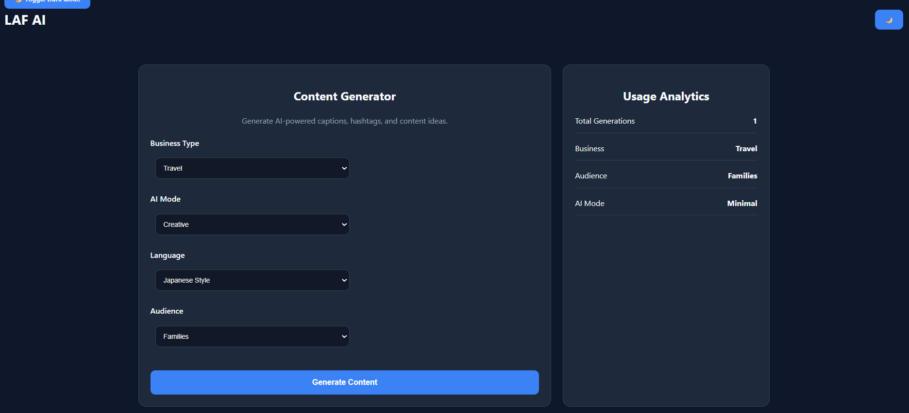
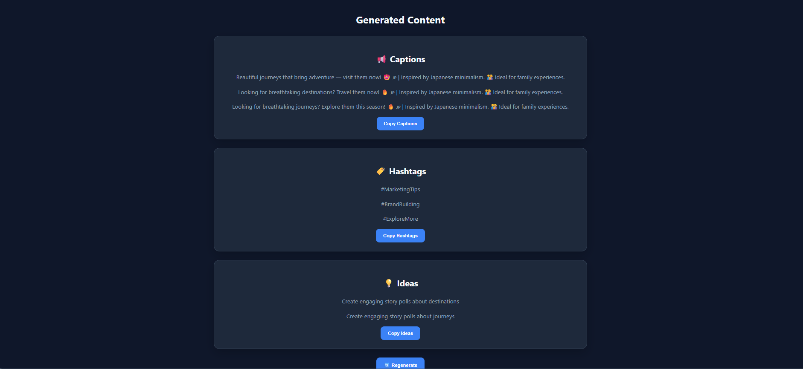
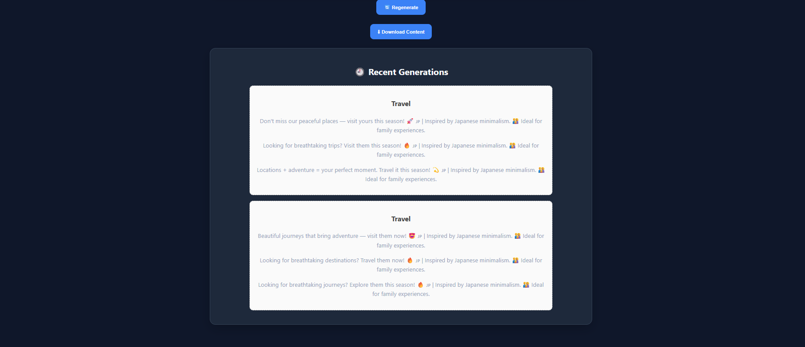

# LAF AI

AI-Powered Content Generation Platform built with Flask, OpenRouter, and a production-oriented service architecture.

---

## Live Demo

https://laf-ai-content-generator.onrender.com

---

## Overview

LAF AI is an AI-powered marketing content generation platform that helps businesses create:

* Marketing Captions
* Social Media Hashtags
* Content Ideas

The application is designed using a modular service-oriented architecture with provider abstraction, structured validation, retry logic, testing, and documentation to demonstrate production-level software engineering practices.

---

## Key Features

### AI Content Generation

Generate:

* Captions
* Hashtags
* Marketing Ideas

### Multiple AI Modes

* Creative
* Professional
* Minimal
* Viral

### Audience-Aware Content

Generate content for:

* Students
* Families
* Professionals
* Tourists

### Language Styles

* English
* Japanese Style

### Analytics Dashboard

Track:

* Total Generations
* Business Type
* Audience
* AI Mode

### Export Support

Download generated content as text files.

### Reliability Features

* Input Validation
* Response Validation
* Retry Logic
* Rate-Limit Handling
* Fallback Content Engine
* Structured Error Handling

---

## Architecture

### System Architecture


### Architecture Highlights

* Provider Factory Pattern
* Service-Oriented Architecture
* Response Schemas
* Validation Layer
* Retry Logic
* Rate-Limit Handling
* Fallback Engine
* Structured Logging
* Multi-Provider Ready Design

---

## Project Structure

```text
LAF-AI/

├── app.py
├── config.py
├── ai_engine.py
├── analytics.py
├── content_engine.py
│
├── constants/
│   ├── business_types.py
│   ├── languages.py
│   └── ai_modes.py
│
├── providers/
│   ├── base_provider.py
│   ├── openrouter_provider.py
│   ├── openai_provider.py
│   ├── claude_provider.py
│   └── provider_factory.py
│
├── services/
│   ├── ai_service.py
│   ├── validation_service.py
│   ├── prompt_service.py
│   ├── parsing_service.py
│   ├── logging_service.py
│   └── response_validation_service.py
│
├── schemas/
│   └── content_schema.py
│
├── exceptions/
│   └── provider_errors.py
│
├── templates/
│   └── index.html
│
├── static/
│   ├── style.css
│   └── script.js
│
├── tests/
│
├── docs/
│
└── screenshots/
```

---

## Screenshots

### Dashboard



### Generated Content



### History



---

## Technology Stack

### Backend

* Python
* Flask

### AI

* OpenRouter
* OpenAI SDK

### Frontend

* HTML
* CSS
* JavaScript

### Testing

* Pytest

### DevOps

* GitHub Actions
* Render

---

## Installation

```bash
git clone <repository-url>

cd LAF-AI

pip install -r requirements.txt
```

---

## Environment Variables

Create a `.env` file:

```env
OPENROUTER_API_KEY=your_api_key

SECRET_KEY=your_secret_key
```

---

## Run Locally

```bash
python app.py
```

Application URL:

```text
http://127.0.0.1:5000
```

---

## Testing

Run all tests:

```bash
pytest -v
```

### Current Test Coverage

* Validation Tests
* Parsing Tests
* Response Schema Tests
* Response Validator Tests
* Route Tests
* Fallback Tests

### Status

```text
11/11 tests passing
```

---

## CI/CD

GitHub Actions automatically:

* Install dependencies
* Run pytest
* Validate application integrity

on every push and pull request.

---

## Engineering Decisions

Documentation available in:

```text
docs/

architecture.md
api-flow.md
technical-decisions.md
scalability.md
```

Topics covered:

* Architecture Design
* API Flow
* Scalability Strategy
* Technical Trade-offs
* Provider Abstraction

---

## Scalability Considerations

Future improvements include:

* PostgreSQL persistence
* Redis caching
* Docker containerization
* Background task queues
* Multi-user authentication
* Team workspaces
* Multi-provider AI selection

---

## Deployment

Platform: Render

Production URL:

https://laf-ai-content-generator.onrender.com

---

## Author

Lia Aleen Irshad
